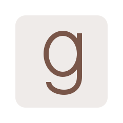

  

### Hi there 👋
- russia is a terrorist state :yellow_square::blue_square:
- I am a Software Development Engineer at <a href="https://www.adorama.com/">Adorama</a>.

  
  
  
  

<!--
**omelianlevkovych/omelianlevkovych** is a ✨ _special_ ✨ repository because its `README.md` (this file) appears on your GitHub profile.

Here are some ideas to get you started:

- 🔭 I’m currently working on ...
- 🌱 I’m currently learning ...
- 👯 I’m looking to collaborate on ...
- 🤔 I’m looking for help with ...
- 💬 Ask me about ...
- 📫 How to reach me: ...
- 😄 Pronouns: ...
- ⚡ Fun fact: ...
-->
